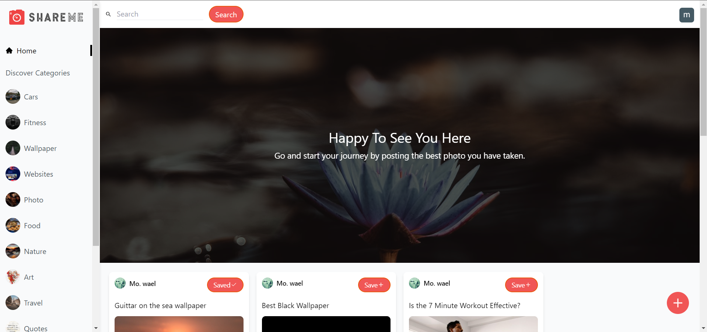

# Table of Contents

- [LiveDemo](#live-demo)
- [Overview](#overview)
- [How to use](#how-to-use)
- [Tools](#tools)
- [How to run the project](#How-to-run-the-ShareMe-project)

## Live Demo

You can get live demo from here [Share Me](https://sharememw.netlify.app)
[](https://sharememw.netlify.app/)

## Overview

hare Me is a social media web app. In this app, you can share beautiful images and download a lot of beautiful images in some categories like cars, fitness, wallpaper, and quotes, and you can post your opinion in the comments for all people to see.

## How to use

1. **Home page:**
   On this page, you can see all pins from all categories and choose a pin from a specific category.
2. **Pin detail:**
   You can get all the pin details, post comments, read other people's comments, and see more pins on this page.
3. **Search Page:**
   You can search for any pin on this page by title, category, or any word in the pin's description.
4. **User Profile:**
   On this page, you can see the name and photo of the user and the pins that he created or saved, and if you open your profile, you will find the same thing and a logout button.

## Technologies

- Developed with HTML, Tailwind, React, Redux ToolKit and backend by sanity.io.

## How to run the ShareMe project

to clone the repository in your computer

- ```shell
  $git clone https://github.com/Momenwael21/ShareMe.git
  ```

### In the repository folder:

#### To install dependencies

If you use React v18.0 run:-

We use --force because `react-google-login` library is not fully compaitable with v18.0 and we use `gabi-scripts` library

```shell
- $npm install --force
```

if you use React v17.0 or less run:-

```shell
- $npm install
```

to start the development server run:-

```shell
- $npm start
```
